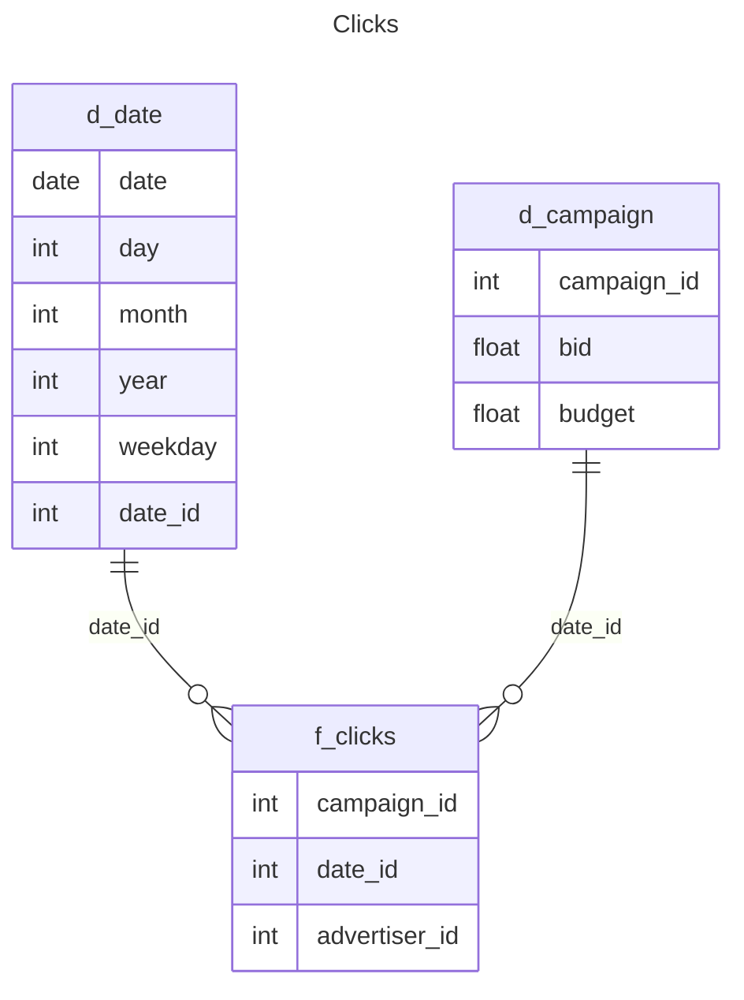
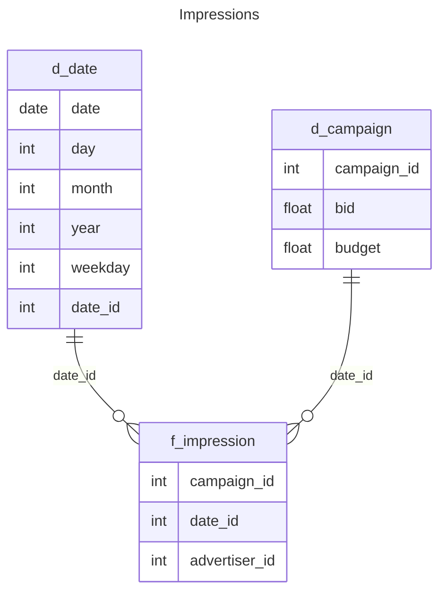
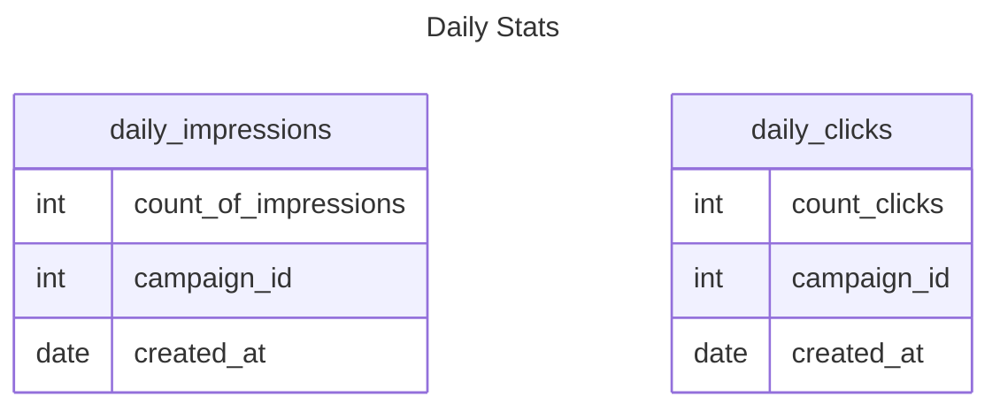

# Data Engineering Task Solution: AdTech Data Pipeline

## Overview

Use airflow a engine to generate a data pipeline to transfer information between database (PostgreSQl) and ClickHouse

## Design

Task used flyway to generate the schema for clickhouse database you see it in [docker-compose](./docker-compose.yaml) flyway_clickhouse service.

As pipeline engine we used airflow. This allow os to monitor the pipelines progress.

## Structure

```bash
/dags
    # Dimension Tables
    /pipe_generate_campaigns_dimension.py 
    # Campaign Dimension Table
    /pipe_generate_time_dimension.py
    # Time Dimension Table
    /pipe_generate_daily_clicks.py
    # Daily Clicks
    /pipe_generate_daily_impressions.py
    # Daily Impressions
    # Fact Tables
    /pip_generate_fact_clicks.py
    /pip_generate_fact_impressions.py
/docs 
# Jupyter Notebooks for initial exploration of the schema and model.
/migrations_analytics
# Migrations for Analytics DB (Clickhouse)
```

## Dependencies

- Just: https://github.com/casey/just
- UV: https://github.com/astral-sh/uv
- Docker: https://www.docker.com/

## Instructions

1. just setup_airflow

## Design

### Design Analyis

As part of the goals of building a Database Schema that can support the generation of: 

   - Click-Through Rate (CTR) by campaign
   - Daily impressions and clicks
   - Anything else you might find interesting

We are going to assume two things. One is the generation of CRT by campaign can be generated in daily, weekly, monthly. yearly. Also we are going to assume that `Daily Impressions and clicks` is  used in a Dashboard

With that assumptions in place i choose to have a star schema were i treat independently the time dimension  from the facts (so is more easy to slide it in different time dimensions).

Also we are going to build a dimension table for campaign have the bid and the budget.

Analytic Schema:







## Implementation

We used some pipelines to be able to have all the correct data in place.

|  file | Purpose |    
|:-----:|:-------:|
| [Campaign Dimension](/dags/pipe_generate_campaigns_dimension.py) | Create Campaign Table Dimension |
| [Time Dimension](/dags/pipe_generate_time_dimension.py) | Create Time Table Dimension |
| [Daily Clicks](/dags/pipe_generate_daily_clicks.py) | Generate the daily clicks stats counting them by day |
| [Daily Impressions](/dags/pipe_generate_daily_impressions.py) | Generate the daily impressions stats counting them by day |
| [Fact Clicks](/dags/pipe_generate_daily_clicks.py) | Generate Fact Clicks Table, this table for this purpose is only a copy of the clicks table in postgresql but can be used to generate stats. |
| [Fact Impressions](/dags/pipe_generate_daily_impressions.py) | Generate Fact Impression Table, this table for this purpose is only a copy of the impressions table in postgresql but can be used to generate stats. |

### How to Used

Run the following commands in order in different terminals

- command: `just setup_1`
- command: `just setup_2`
- command: `just setup_3`
- command: `just generate_data`
- command: `just install_dag`
- command: `just run_dags`


#### KPIS
You can run the following queries to get KPIs.

##### Click-Through Rate (CTR) by campaign

```sql
-- Daily CRT and daily count of impressions and clicks
select dc.campaign_id,dc.count_of_clicks,
       di.count_of_impressions,
       dc.count_of_clicks/di.count_of_impressions * 100 as CRT
from daily_clicks dc join daily_impressions di on toDate(dc.created_at) = toDate(di.created_at)
and dc.campaign_id = di.campaign_id
order by CRT desc;
```

##### Daily impressions

```sql
-- Daily Impressions
select * from daily_impressions;
```

##### Daily clicks

```sql
-- Daily Clicks
select * from daily_clicks;
```

##### Cost of a click by campaign

```sql
-- Is the campaign on budget
-- how expensive is one click
select cd.campaign_id,
       (count(1)* cd.bid)/count(1) cost_per_click from fact_clicks dc,
                                                    campaign_dimension cd
                                               where cd.campaign_id = dc.campaign_id
group by cd.campaign_id, cd.bid, cd.budget;
```

##### How many budgets where used by campaign 

```sql
-- how much of the percentage of the budget was used assuming bid is the prices of the impression
select cd.campaign_id,
       (count(1)* cd.bid)/cd.budget * 100, (count(1)* cd.bid) cost, cd.budget  from fact_impressions dc,
                                                    campaign_dimension cd
                                               where cd.campaign_id = dc.campaign_id
group by cd.campaign_id, cd.bid, cd.budget;
```

